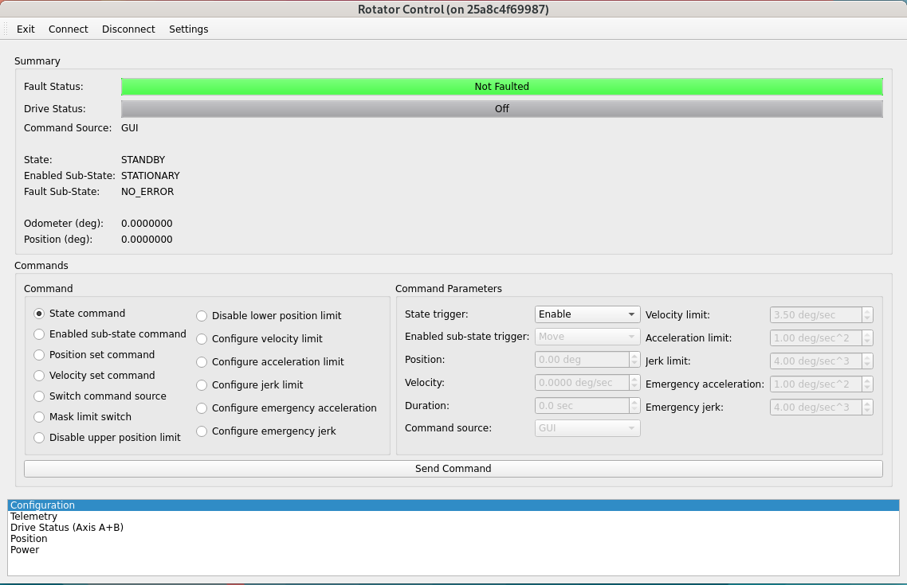

.. _User_Guide:

################
User Guide
################

This graphical user interface (GUI) is a Qt-based application to control the actuators, observe sensor telemetry, show the configurable parameter settings of the rotator control system, clear errors, and diagnose issues observed during the operation.
This GUI is supposed to be used by the hardware engineers or operators to have a more detailed control of hardware compared with the automatic or remote mode (a.k.a. commandable SAL component, CSC): `ts_mtrotator <https://ts-mtrotator.lsst.io/>`_.
If the GUI can not enable the system, the rotator CSC will not be able to as well because they are using the same interface to the control system.
Functionality of the GUI will be discussed in detail to provide the reader a comprehensive source for understanding the operation of GUI.

.. note::
  This GUI is to replace the original LabVIEW GUI: `ts_rotator_gui <https://github.com/lsst-ts/ts_rotator_gui>`_, and the related executable is ``runRotEui``.

.. _Controller_State:

Controller State
================

The following states are defined in the rotator controller:

.. _Controller_State_standby:

Standby State
-------------

The **Standby** state has no substates.
No motion can be commanded from this state and the motor drives remain disabled.
To transition from **Standby** state to **Enabled** state, an enabled state command must be sent.
In the transitioning, the control system will read the configuration file in controller, and apply the related settings.

.. _Controller_State_enabled:

Enabled State
-------------

In the **Enabled state**, the motor drives are enabled and motion can be commanded.
To transition back to **Standby** state from the **Enabled** state, a standby state command must be sent.

There are 5 substates within the **Enabled** State: **Stationary**, **MovingPt2Pt**, **SlewingAndTracking**, **ControlledStopping**, and **ConstVel**.
When entering **Enabled** state, the system will begin in **Stationary** substate.
After setting the rotator's position, you can send an enabled-substate command of **Move** to do the movement.
When this occurs, the system will transition from **Enabled**/**Stationary** substate to **Enabled**/**MovingPt2Pt** substate.
Once the movement is completed, the system will automatically transition back to **Enabled**/**Stationary** substate and will then be ready to receive new commands.

Sometimes, you may want to move the rotator with a constant and slow velocity to inspect the hardware or mimic the tracking process.
After setting the related velocity and duration, you can send an enabled-substate command of **MoveConstantVel** to do the movement.
You will see the system transtions to the **Enabled**/**ConstVel** substate.

For any movement, you can always issue a stop command to cause the system to transition to the **Enabled**/**ControlledStopping** substate where decelerates to a stop and then automatically transitions back to the **Enabled**/**Stationary** substate.

At the moment, only the CSC supports the tracking command of rotator.
When the rotator is tracking, the system transtions to the **Enabled**/**SlewingAndTracking** substate.

.. _Controller_State_fault:

Fault State
-------------

If a fault occurs in the **Enabled** state, the system will automatically transition to the **Fault** state with an emergency stopping if required.
At the emergency stopping, the system will transition to the **Fault**/**EmergencyStopping** substate followed by the **Fault**/**WaitClearError** substate.
While in the **Fault** state, a state command of clear-error will cause a transition to the **Standby** state and will also clear any errors that are no longer present.

.. _Operation:

Operation
============

Use the command line in terminal to run the GUI by ``run_rotgui``.
The simulation mode is provided to let you to be familiar with the application.
You can do the following to get more information of GUI.

.. code:: bash

    run_rotgui -h

By default, there will be a log file created under the ``/rubin/rotator/log`` or ``$HOME`` directory to support the debug.
You can assign the `logging level <https://docs.python.org/3/library/logging.html#logging-levels>`_ from the command line or use the GUI (see :ref:`lsst.ts.rotgui-user_settings`).

The operation of GUI is explained below.
For each action (or click the button), you need to wait for some time to let the GUI finish the related command with the control system in the timeout period.

.. _lsst.ts.rotgui-user_control_panel:

Control Panel
-------------

  Control panel of application

After the execution of GUI, you will see the above control panel.
You can use the top toolbar to change the **Settings** of GUI, **Connect**/**Disconnect** the rotator controller, and **Exit** the application.

The top region of control panel shows the summary of the rotator system.
You can see that whether the rotator is in fault, the Copley drive is enabled, the command source is GUI or CSC, current controller's state, enabled sub-state, fault sub-state, odometer, and current position.

The middle region of control panel lists the available commands to the control system.
Once a command is selected, the related parameters will be shown as well to let you change the values.

After selecting the command and changing the parameters, you can click the **Send Command** button to send the command to the control system.

The bottom region of control panel has multiple tables that you can double-click to open to have more detailed system information.
If you move the mouse close to the buttons/indicators and texts in the panel and tables, you will see the prompted tips to explain the related details.

.. _lsst.ts.rotgui-user_important_command:

Important Commands
^^^^^^^^^^^^^^^^^^

Some important commands are listed below:

#. State command lets you change the controller's state between **Standby** and **Enabled** states. If there is the fault, you can clear the error here.

#. Enabled-sub-state command lets you move the rotator once setting the rotator's position, do the constant velocity movement, track the target, or stop the rotator's movement.

#. Switch-command-source command sets the command source to be GUI or CSC.

#. Mask-limit-switch command masks the limit switch of the rotator. This is needed to move off of a limit switch if a switch is ever activated. If a limit switch is tripped, send this command and the system temporarily ignores the limit switch and allows the system move off the switch. Once the system moves off the switch, limit switch functionality returns to normal operation.

#. Disable-upper-position-limit command lets the controller disable the upper position limit temporarily in a specified duration in the controller. You might need to apply this when masking the limit switch.

#. Disable-lower-position-limit command is similar to the disable-upper-position-limit command, but disables the lower position limit instead.

#. Configure related commands let you configure the velocity, acceleration, and jerk limits under the normal or emergency condition.

.. _lsst.ts.rotgui-user_settings:

Settings
--------

  Settings of application

You can modify the settings in application.
The default values come from the configuration file.
You can do the following things:

#. Update the host name, port, and connection timeout in TCP/IP connection.

#. General settings of application. You can use the different `logging level <https://docs.python.org/3/library/logging.html#logging-levels>`_ to support the debugging if needed. The log file will be in the ``/rubin/rotator/log`` directory. If it does not exist in file system, the log file will be in the ``$HOME`` directory.

After the modification of settings, you can click the related **Apply** button to use the new values.

.. _lsst.ts.rotgui-user_exit:

Exit
----

  Exit the application

You can click the **Exit** button to leave the application, and a window will prompt out to confirm this action.
Before the exit, you need to disconnect the GUI from the controller first.
Since the default command source should be CSC, there will a warning dialog to notify you if the current command source is GUI.

.. _lsst.ts.rotgui-user_configuration:

Configuration
-------------

  Configuration

You can use the configuration table to observe the current values of the configurable parameters in the rotator controller.
It shows the position/velocity/acceleration/jerk limits, maximium time to disable the position limits, and thresholds of position and tracking errors.

.. _lsst.ts.rotgui-user_telemetry:

Telemetry
---------

  System telemetry

You can use the telemetry table to observe the current telemetry in the rotator controller.
At the left of table, the current position and power of the rotator are displayed.
The commanded axis rates and the related feedbacks and torques are shown. 

At the middle, the time between telemetry samples is displayed.
By default, the telemetry is 20 Hz and you should expect to see the time frame difference is around 0.05 seconds.
You can see the Simulink flags for the current status in model.
For example, you can see the moving or tracking are successful or not.
You can also see the stopping is completed or not.
If there is the following error or lost of tracking, you can see the related flags here as well.

At the right of table, the application status items are displayed to show the current status of the rotator controller.
These indicators are especially useful for troubleshooting and diagnostics such as the safety interlock, limit switches, drive fault, Simulink fault, and others.

.. _lsst.ts.rotgui-user_drive_status:

Drive Status
------------

  Copley drive status

You can use the drive status table to observe the current Copley drive status.
It includes the status words, latched faults, manufacturer’s (Copley motor drive) status, and input pins information.
It is primarily used for diagnostics and troubleshooting.

.. _lsst.ts.rotgui-user_position:

Position
--------

  Rotator position

You can use the position table to observe the current rotator's position and velocity.
The top shows the time history of the rotator's position.
The bottom shows the time history of the rotator's velocity.

.. _lsst.ts.rotgui-user_power:

Power
-----

  Power status

You can use the power table to observe the actuator's currents and bus voltage.
The top shows the current of two actuators.
The bottom shows the bus voltage of drive.
